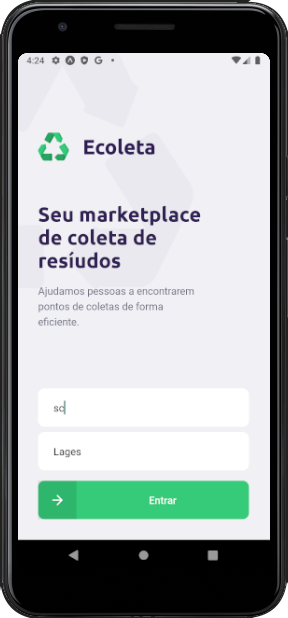

# Backend

## Installation
```
1. npm install or yarn

2. npm run knex:migrate or yarn knex:migrate

3. npm run knex:seed or yarn knex:seed

4. npm run dev or yarn dev
```
# Frontend

## Installation
```
1. npm install or yarn

2. npm start or yarn start
```

# Mobile

## Download the client for run application

[Expo Android](https://play.google.com/store/appsdetails?id=host.exp.exponent&hl=pt_BR)

[Expo IOS](https://apps.apple.com/br/app/expo-client/id982107779)

## Installation
```
1. npm install expo-cli --global

2. npm install or yarn

3. expo start
```
